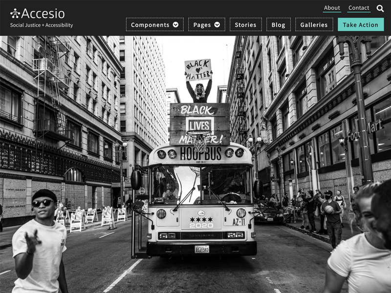

# Accesio: A Drupal 9 component based theme centering around accessibility and social justice.

## Conventions
* Granular approach to CSS. Load only what is needed on any given page via a component based CSS approach. 
* Minimal base theme using Stark as well as unsetting core libraries using `hook_library_info_alter`.
* Modular content using the Paragraphs module.
* Twig field value for clean readable classes which removes most field markup expect in cases where needed.
* BEM style classes and CSS

## @TODO
1. Convert jquery accessible mega menu to vanilla using [https://github.com/adityakahb/amegmen](https://github.com/adityakahb/amegmen)
2. Re-write any custom jQuery with vanilla JS. Note, we probably won't be able to get rid of jQuery entirely until this issue is worked through. "[meta] Replace JQuery with vanilla Javascript in core" - [https://www.drupal.org/project/drupal/issues/3052002](https://www.drupal.org/project/drupal/issues/3052002), specifically this issue with regard for Ajax. [https://www.drupal.org/project/drupal/issues/3189416](https://www.drupal.org/project/drupal/issues/3189416) Note, we are already using [https://www.drupal.org/project/once](https://www.drupal.org/project/once) which replaces jQuery once.
3. Work out how to minify CSS on production. Do we use Advanced Aggregation?
4. Accessibility testing
5. Introduce Layout Builder for some entity types?

## Screen captures

